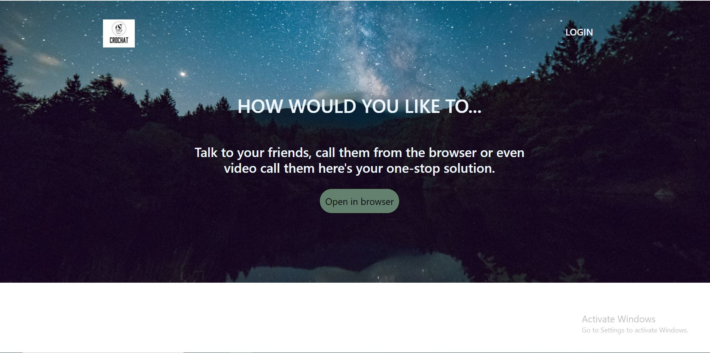
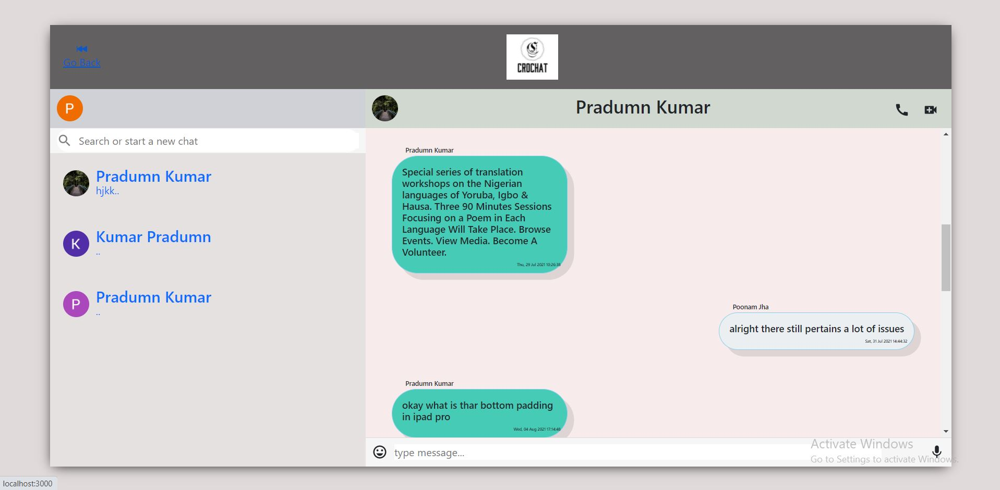
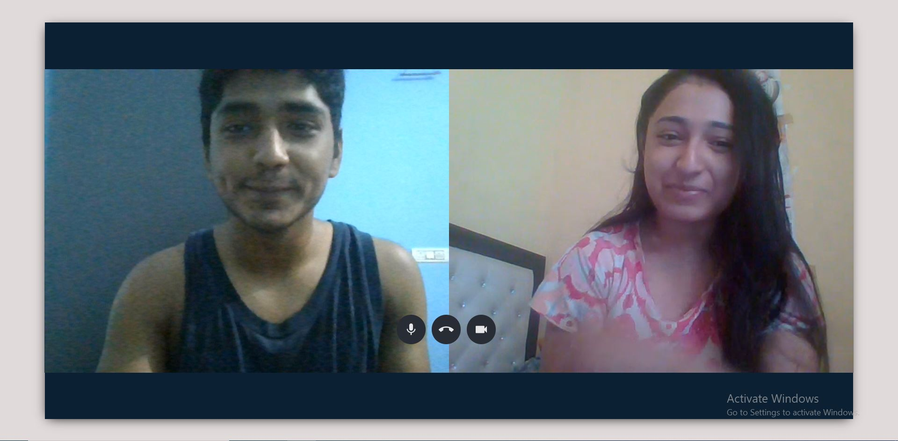
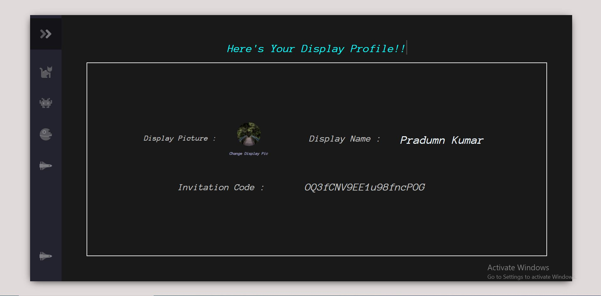
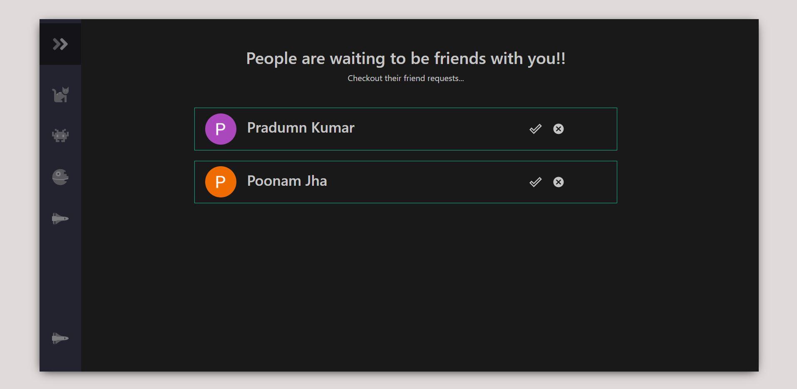

# CroChat

### [Live Site](https://crochat.netlify.com)



## Introduction
- CroChat is a Realtime Chatting Web Application. 

- The application provides a portal for the users to connect with their friends worldwide.

- The application also allows the features to Call and Video Call people straight from the browser 

## ScreenShots
        
    

## How to setup the environment:
- Clone the repository on your system
- cd in the Client directory
- run ```npm install```
- run ```npm i && npm start``` 
- cd in the Server directory
- run ```npm install```
- run ```npm i && npm start``` 
- visit localhost:3000 in your browser

### Technologies Used
- React.js
- Node.js
- Express.js
- Socket.io
- Firebase Firestore for storing database
- Firebase Authentication
- Firebase Cloud Storage

